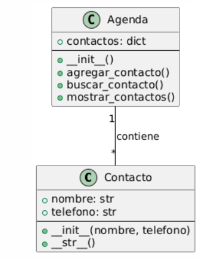

# 📂 Proyecto: Agenda de Contactos

## 📝 Descripción del Proyecto
Este es un programa simple de consola, escrito en Python, que simula una agenda de contactos. El objetivo principal de este proyecto es aplicar y demostrar los principios de la **Programación Orientada a Objetos (POO)**. En lugar de usar funciones sueltas, la lógica del programa se organiza en **clases y objetos**, lo que lo hace más modular y escalable.

## 🧭 Tabla de Contenidos
- [Descripción del Proyecto](#descripción-del-proyecto)
- [Funcionalidades](#funcionalidades)
- [Principios de POO y Estructuras de Datos](#principios-de-poo-y-estructuras-de-datos)
- [Diagrama de Clase](#diagrama-de-clase)
- [Cómo ejecutar el programa](#cómo-ejecutar-el-programa)
- [Cómo subir el proyecto a GitHub](#cómo-subir-el-proyecto-a-github)
- [Autor](#autor)

## 🚀 Funcionalidades
El programa ofrece un menú interactivo con las siguientes opciones para que el usuario pueda gestionar sus contactos:
1.  **Agregar un contacto**: Permite al usuario guardar un nuevo contacto (nombre y número de teléfono).
2.  **Buscar un contacto**: Encuentra y muestra el número de teléfono de un contacto existente usando su nombre.
3.  **Mostrar todos los contactos**: Lista todos los contactos guardados en la agenda en orden alfabético.
4.  **Salir**: Termina la ejecución del programa.

## 🧠 Principios de POO y Estructuras de Datos
Este proyecto está construido usando dos clases que representan los componentes principales de la agenda:
-   **Clase `Contacto`**: Encapsula los datos de un solo contacto. Cada objeto de esta clase contiene atributos como `nombre` y `telefono`.
-   **Clase `Agenda`**: Actúa como un contenedor y gestor de los objetos `Contacto`. Esta clase utiliza un **diccionario** internamente para almacenar los contactos, lo que permite una **búsqueda extremadamente rápida** y eficiente.

Para la funcionalidad de "Mostrar todos los contactos", el programa utiliza la función `sorted()` de Python. Esta función ordena las claves del diccionario (los nombres de los contactos) para que se muestren de manera alfabética, lo que mejora la experiencia del usuario.

## 🎨 Diagrama de Clase
Este diagrama de clases ilustra la estructura y las relaciones entre los componentes de la agenda, demostrando la arquitectura de programación orientada a objetos.



## 🛠️ Cómo ejecutar el programa
1.  Asegúrate de tener **Python** instalado en tu computadora. Puedes verificarlo abriendo una terminal y ejecutando `python --version` (o `python3 --version` en algunos sistemas).
2.  Guarda el código del proyecto en un archivo llamado `agenda.py` y el contenido de este README en un archivo `README.md`.
3.  Abre tu terminal o la consola de VS Code.
4.  Navega hasta el directorio donde guardaste los archivos.
5.  Ejecuta el siguiente comando para iniciar la agenda:
    ```sh
    python agenda.py
    ```
    El programa se ejecutará y te presentará el menú interactivo en la consola.

## 🔗 Cómo subir el proyecto a GitHub
Sigue estos pasos para subir tu proyecto a un nuevo repositorio en GitHub usando la línea de comandos:
1.  **Inicializa un repositorio Git local:**
    ```sh
    git init
    ```
2.  **Agrega los archivos:**
    ```sh
    git add .
    ```
3.  **Realiza el primer commit:**
    ```sh
    git commit -m "Primer commit: proyecto de agenda de contactos"
    ```
4.  **Conecta con tu repositorio en GitHub:**
    ```sh
    git remote add origin [URL_DEL_REPOSITORIO]
    ```
    (Reemplaza `[URL_DEL_REPOSITORIO]` con la URL que GitHub te proporciona al crear el repositorio.)
5.  **Sube los archivos:**
    ```sh
    git push -u origin main
    ```

## ✍️ Autor
* **[Tu Nombre Completo]** - [Tu perfil de GitHub](URL_de_tu_perfil)
